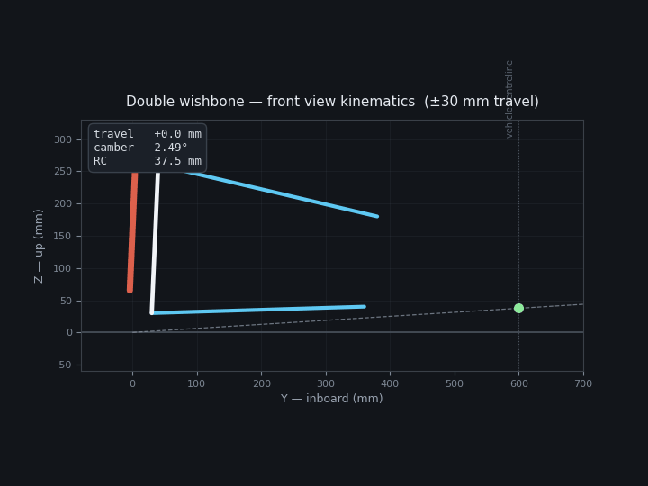
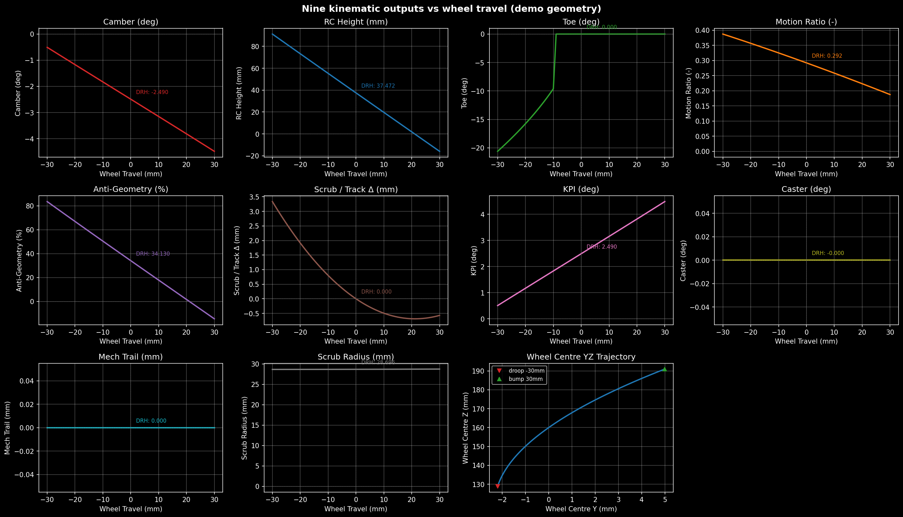
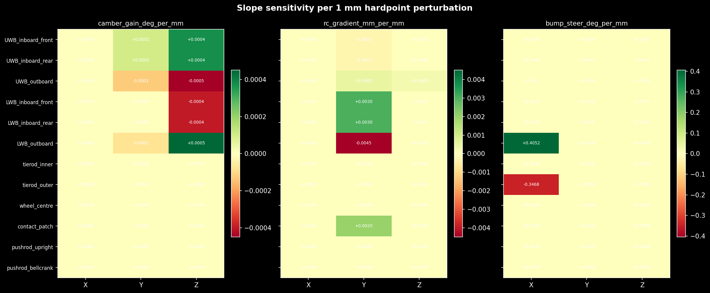
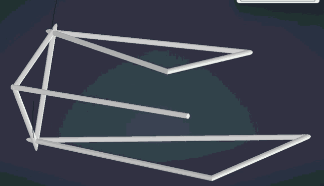
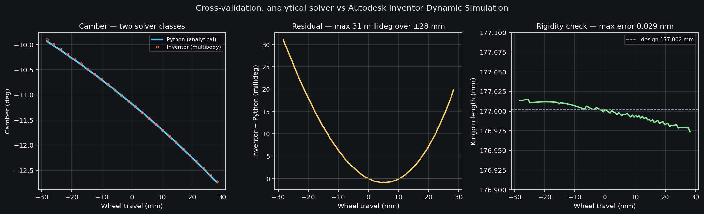
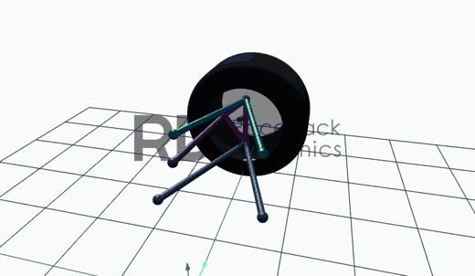
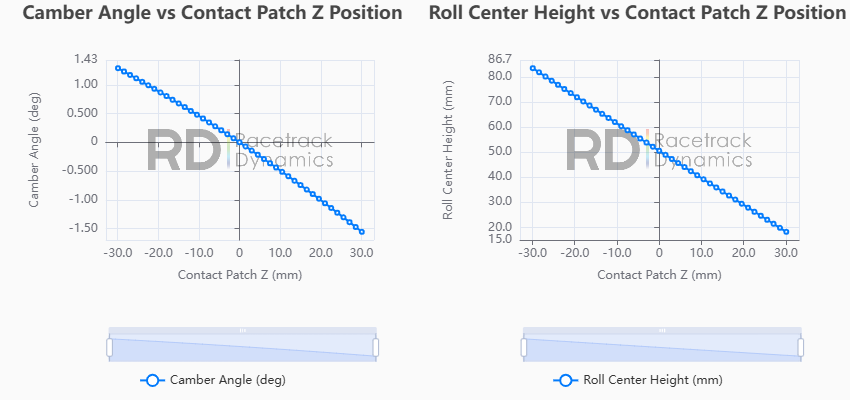

# Suspension Kinematics Solver

A four-corner double wishbone suspension kinematics solver written in Python, validated
against a commercial multibody simulation and two independent kinematics tools.

Given twelve hardpoints per corner, it sweeps wheel travel and returns nine kinematic
outputs, plus a slope-based sensitivity map showing which hardpoints control which curve.



*Front-view kinematics through ±30 mm of travel. The dashed line runs from the contact
patch through the instant centre; the green marker is the roll centre, tracing its
migration up the vehicle centreline.*

---

## Why this exists

Suspension geometry is decided before anything is built. Where the wishbone pickups sit
determines how the wheel cambers over a bump, how much the tyre steers itself over kerbs,
and how lateral force splits between the links and the springs. Those questions have to
be answered analytically, from coordinates, long before there is a car to measure.

Tools that do this exist. The point of writing one from scratch is that every assumption
is visible and every output can be traced back to the geometry that produced it — and
that when it disagrees with something, you can find out why.

---

## Outputs

| Output | Notes |
|---|---|
| Camber | and camber gain (deg/mm) at design ride height |
| Roll centre height | referenced to the ground plane |
| Bump steer | toe change from the tie rod constraint |
| Motion ratio | pushrod angle basis — see limitations |
| Anti-geometry | front-view construction — see limitations |
| Kingpin inclination | front-view steering axis tilt |
| Caster | side-view steering axis tilt |
| Mechanical trail | steering-axis ground intersection ahead of the patch |
| Scrub radius | front-view offset at the ground |
| Scrub | lateral contact patch migration with travel |
| Wheel centre trajectory | front-view path, droop to bump |



---

## How it works

The wheel travel is the input, but the wishbone outboard points cannot simply be
displaced vertically — each is constrained to an arc about its inboard axis, with the arm
length fixed. The solver treats each wishbone as a rigid body and finds the rotation that
satisfies the height constraint:

For a rotation `δθ` about the inboard axis, the outboard point's height obeys

```
A·cos(δθ) + B·sin(δθ) = C
```

where `A` and `B` come from decomposing the arm into components parallel and
perpendicular to the axis. Two solutions exist; the solver takes the smaller `|δθ|` and
applies it with Rodrigues' rotation formula.

The upright is then carried rigidly by its two ball joints, so the contact patch and
wheel centre migrate correctly rather than translating vertically — which is what makes
the scrub and wheel-centre trajectory outputs meaningful.

Toe is the remaining degree of freedom. The upright can still rotate about its kingpin
axis, and the tie rod — fixed length, anchored to the chassis — decides that angle. The
solver finds it by root-solving the tie rod length constraint. This is the correct
formulation: an earlier version translated the tie rod outer point and divided by a
moment arm, which overstated bump steer ninefold.

---

## Sensitivity mapping

Static values can be shimmed. Gains are baked into the hardpoints. So the sensitivity
analysis perturbs each coordinate by ±1 mm and reports the change in **curve slope** at
design ride height — camber gain, roll centre gradient, bump steer gradient — rather than
the change in the static value.



The practical use is decoupling. If camber gain needs changing without disturbing the
roll centre, the map identifies which coordinate has leverage on one and not the other.

---

## Validation

The solver was run on the front corner geometry of a Formula Student car and checked four
ways, against team design documentation and three independent implementations.

### Against a multibody solver

The same twelve hardpoints were built as a constrained mechanism in Autodesk Inventor
Dynamic Simulation: two revolution joints at the wishbone pivots, four spherical joints
at the ball joints and tie rod ends, driven through the equivalent of ±28 mm of wheel
travel.



This is a genuinely different class of solver — numerical constraint satisfaction rather
than closed-form geometry — so agreement tests the result rather than the implementation.



Inventor reports spherical joint positions as Euler angles, not coordinates, so the ball
joint positions were reconstructed from the two revolution joint angles by rotating each
wishbone about its own inboard axis. That reconstruction carries its own falsifier: if
either solver were wrong, the distance between the reconstructed ball joints would not
stay constant. Across 101 timesteps it held the design kingpin length to within
**0.029 mm on 177 mm — 0.016%**.

| | Analytical | Inventor multibody | Difference |
|---|---|---|---|
| Camber gain at DRH | −0.0493 °/mm | −0.0496 °/mm | 0.6% |
| Caster at DRH | 3.1762° | 3.1767° | 0.0005° |
| Kingpin inclination at DRH | 11.1805° | 11.1811° | 0.0006° |
| Max camber deviation, full sweep | — | — | **0.031°** |
| Max caster deviation, full sweep | — | — | 0.019° |

Agreement holds across the whole travel range, not only at the design point.

### Against an independent kinematics tool

The same hardpoints were entered into RD KineSolver, a third-party analytical tool.




*Renders and plots © [Racetrack Dynamics](https://racetrackdynamics.com/kinesolver/),
produced from this project's hardpoint set.*

| | This solver | KineSolver |
|---|---|---|
| Camber gain | −0.049 °/mm | ≈ −0.05 °/mm |
| Roll centre at DRH | 48.6 mm | ≈ 50 mm |
| Roll centre gradient | −1.10 mm/mm | ≈ −1.08 mm/mm |
| Caster | 3.177° | ≈ 3.15° |
| Kingpin inclination | 11.181° | ≈ 11.2° |
| Scrub radius | 22.11 mm | ≈ 22.1 mm |
| Mechanical trail | 11.27 mm | ≈ 11.25 mm |

KineSolver values are read from plots, so they carry graph-reading precision.

This cross-check caught two real errors. The roll centre was being reported in the
chassis frame rather than above the ground plane — identical at design ride height, but
the gradient differed seventeenfold because the contact patch itself rises with the
wheel. And the bump steer was ninefold too large, from the simplified tie rod model
described above. Both are fixed; the current figures are post-fix.

### Against design documentation

Five parameters computed from the as-built hardpoints, checked against the team's own
design values:

| Parameter | Solver | Documented | Error |
|---|---|---|---|
| Caster | 3.177° | 3.18° | 0.003° |
| Kingpin inclination | 11.181° | 11.14° | 0.4% |
| Scrub radius | 22.11 mm | 22.25 mm | 0.6% |
| Roll centre, front | 48.62 mm | 48.6 mm | <0.1% |
| Roll centre, rear | 53.27 mm | 53.3 mm | <0.1% |

### One parameter that does not agree

Camber gain comes out at **−0.049 °/mm** against a documented **−0.066** — a 26%
discrepancy. Three further implementations agree with this solver: a separate five-link
model (−0.047), KineSolver (≈−0.05), and the Inventor multibody solve (−0.0496).

Since every other output from the same hardpoint set reproduces the documentation closely,
the likely cause is not method but geometry: camber gain is dominated by the inboard
pickup positions, and multiple generations of those coordinates are in circulation,
differing by up to 20 mm. Resolving it requires measuring the as-built assembly directly.

The finding is recorded here as an open question, not a correction.

---

## Limitations

Stated plainly, because a validated tool is only useful if its boundaries are known.

**Absolute camber is not valid.** The solver derives orientation from the two ball joints,
so it reports the kingpin axis angle. On a real upright the wheel plane is offset from the
steering axis, and the wheel-axis points were not available. Camber *gain* is unaffected —
the upright rotates rigidly, so the change in axis angle equals the change in wheel camber.

**Motion ratio is a pushrod-angle cosine.** It ignores the rocker leverage ratio, so it
does not reproduce a real installation ratio. Closing this needs the bellcrank geometry
and is on the roadmap below.

**Anti-geometry uses the front-view instant centre.** Correct anti-dive and anti-squat are
side-view constructions, with force applied at the contact patch for braking and the wheel
centre for traction. The current output is a placeholder.

**Kinematics only, no compliance.** Bushes, link bending and chassis deflection all move
the wheel under load. This solver assumes rigid bodies and perfect joints — the difference
between a kinematic model and a K&C measurement.

**No roll case.** Roll centre migration in roll requires solving both corners with opposite
travel. The current sweep is pure heave.

---

## Roadmap

- **Rocker-actuated motion ratio.** Chain a second constraint solve through the bellcrank
  to produce a travel-dependent installation ratio. Worth doing specifically: the reference
  car's documented motion ratio varies across travel and several conflicting values are on
  record, which this would settle.
- **Side-view anti-geometry** with the correct force application points.
- **Steer sweep and Ackermann error** across rack travel.
- **Two-corner roll case** for roll centre migration in roll.

---

## Usage

```bash
python solver.py
```

Runs both axles on the bundled demo geometry, prints a design-ride-height summary, writes
CSVs, and renders the curve set and sensitivity heatmap.

To use your own geometry, replace the hardpoint dictionaries at the top of `solver.py`.
Coordinates are SAE: X forward, Y inboard positive, Z up, origin at the contact patch,
millimetres throughout.

Requires `numpy` and `matplotlib`.

---

## Note on geometry

The hardpoints bundled with this repository are representative Formula Student values, not
the geometry of any specific car. The validation figures were produced from a real
hardpoint set that is not published here.

## References

- Milliken & Milliken, *Race Car Vehicle Dynamics*
- Blundell & Harty, *The Multibody Systems Approach to Vehicle Dynamics*
- Dixon, *Suspension Geometry and Computation*

## Licence

MIT
